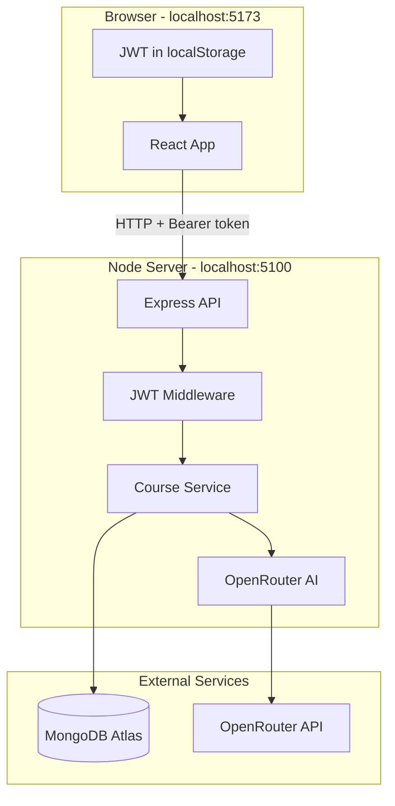
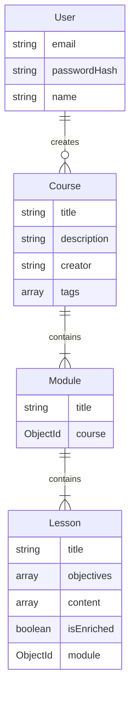

# Text-to-Learn

Full-stack app that turns a topic into a structured course: modules, lessons, quizzes, and code examples.

1. Sign up / log in
2. Enter a topic (e.g. "Intro to React Hooks")
3. The API generates an outline and saves it
4. Opening a lesson generates that lesson's content on demand

## Demo


## Stack

| Layer | Technology | Why we use it |
|-------|------------|---------------|
| Frontend UI | **React 19** | Component-based UI |
| Build tool | **Vite** | Dev server and production builds |
| UI styling | **Chakra UI v3** | Accessible components |
| Routing | **React Router v7** | Client-side pages |
| HTTP client | **Axios** | API calls from the browser |
| Backend | **Express 4** | REST API |
| Database ODM | **Mongoose 8** | MongoDB schemas and queries |
| Auth | **JWT + bcrypt** | Email/password login, stateless tokens |
| AI | **OpenRouter** | Course and lesson generation; JSON validated with Zod |
| Deploy | **Vercel** (client) + **Render** (server) | `client/vercel.json`, `server/render.yaml` |

## Architecture

### How everything connects



- The **browser** shows the React UI.
- "Generate Course" sends a request to the **Express** server.
- The server checks the **JWT**, calls **OpenRouter**, saves the outline in **MongoDB**, and returns JSON.
- Opening a lesson generates that lesson's full content on first visit.

### Repository layout

```
text_to_learn/
├── client/
│   ├── src/
│   │   ├── main.jsx                ← Auth + Chakra + router
│   │   ├── App.jsx                 ← Sidebar + page outlet
│   │   ├── index.css
│   │   ├── pages/
│   │   │   ├── Home.jsx            ← / — course list + generate form
│   │   │   ├── Login.jsx           ← /login
│   │   │   ├── Signup.jsx          ← /signup
│   │   │   ├── CoursePage.jsx      ← /courses/:id
│   │   │   └── LessonPage.jsx      ← lesson viewer
│   │   ├── components/
│   │   │   ├── PromptForm.jsx
│   │   │   ├── SidebarNavigation.jsx
│   │   │   ├── ProtectedRoute.jsx
│   │   │   ├── LessonRenderer.jsx  ← Maps content blocks to UI
│   │   │   ├── LoadingSpinner.jsx
│   │   │   ├── ErrorMessage.jsx
│   │   │   ├── blocks/
│   │   │   │   ├── HeadingBlock.jsx
│   │   │   │   ├── ParagraphBlock.jsx
│   │   │   │   ├── CodeBlock.jsx
│   │   │   │   └── MCQBlock.jsx
│   │   │   └── ui/
│   │   │       ├── provider.jsx
│   │   │       └── toaster.jsx
│   │   ├── context/AuthContext.jsx ← JWT in localStorage
│   │   ├── hooks/useApi.js
│   │   └── utils/api.js
│   ├── vite.config.js
│   └── vercel.json
│
├── server/
│   ├── server.js
│   ├── config/db.js
│   ├── models/                     ← User, Course, Module, Lesson
│   ├── routes/api.js
│   ├── controllers/
│   │   ├── authController.js
│   │   └── courseController.js
│   ├── services/
│   │   ├── courseService.js        ← Create/fetch courses
│   │   └── llmService.js           ← OpenRouter + Zod
│   ├── middlewares/
│   │   ├── auth.js
│   │   └── errorHandler.js
│   └── utils/jwt.js
│
├── .github/workflows/ci.yml
└── README.md
```

### Frontend

`main.jsx` wraps the app in **AuthProvider**, **Chakra UI**, **React Router**, and the **Toaster**.

| URL | File | What the user sees |
|-----|------|-------------------|
| `/login` | `Login.jsx` | Email + password form |
| `/signup` | `Signup.jsx` | Registration form |
| `/` | `Home.jsx` | Course list + generate form |
| `/courses/:courseId` | `CoursePage.jsx` | Modules and lessons |
| `/courses/:courseId/module/:moduleIndex/lesson/:lessonIndex` | `LessonPage.jsx` | Full lesson content |

Routes under `/` are **protected**. On login/signup the server returns a JWT; `AuthContext` stores it in localStorage and `useApi` sends `Authorization: Bearer <token>`.

AI lessons are a JSON array of blocks. `LessonRenderer.jsx` picks the component:

```json
[
  { "type": "heading", "text": "Introduction" },
  { "type": "paragraph", "text": "..." },
  { "type": "code", "language": "python", "text": "print('hi')" },
  { "type": "mcq", "question": "...", "options": ["A","B"], "answer": 0, "explanation": "..." }
]
```

| `type` | Component | Behavior |
|--------|-----------|----------|
| `heading` | `HeadingBlock` | Section title |
| `paragraph` | `ParagraphBlock` | Body text |
| `code` | `CodeBlock` | Syntax-highlighted code |
| `mcq` | `MCQBlock` | Clickable quiz with explanation |

### Backend

`server.js` loads `.env`, connects to MongoDB, enables CORS, parses JSON, mounts `/api`, and uses the global error handler. Default port is **5100** (macOS AirPlay uses 5000).

```
HTTP Request
    ↓
routes/api.js          ← URL → handler
    ↓
middlewares/auth.js    ← JWT on protected routes
    ↓
controllers/*.js       ← Read req, call service, send res
    ↓
services/*.js          ← DB + OpenRouter
    ↓
models/*.js            ← Mongoose schemas
```

Routes do not contain business logic; services do not know about HTTP.

| Service | File | Responsibility |
|---------|------|----------------|
| Course | `courseService.js` | Save/fetch courses; orchestrate AI generation |
| LLM | `llmService.js` | OpenRouter prompts; validate JSON with Zod |

Generation is two-phase so outline creation stays cheap:

1. **Course creation** (`POST /api/generate-course`) — outline only (module titles + lesson titles). Empty lesson stubs are saved.
2. **Lesson open** (`GET /api/lessons/:id`) — if `isEnriched` is false, full content is generated on first visit.

### Database



| Collection | Model file | Key fields |
|------------|------------|------------|
| `users` | `User.js` | `email`, `passwordHash` |
| `courses` | `Course.js` | `title`, `description`, `creator`, `modules[]` |
| `modules` | `Module.js` | `title`, `course`, `lessons[]` |
| `lessons` | `Lesson.js` | `title`, `content[]`, `isEnriched`, `objectives[]` |

### Data flow

**Sign up**

```
Browser (Signup.jsx)
  → POST /api/auth/register { email, password, name }
  → authController.register
  → Hash password with bcrypt
  → Save User to MongoDB
  → Sign JWT
  → Return { token, user }
  → AuthContext saves token in localStorage
```

**Generate a course**

```
Browser (PromptForm.jsx)
  → POST /api/generate-course { topic }
     Header: Authorization: Bearer <jwt>
  → auth middleware verifies JWT
  → courseController.generateCourse
  → courseService.createCourseFromTopic
  → llmService.generateCourseOutline (OpenRouter)
  → Save Course + Modules + empty Lessons
  → Return course JSON
  → Navigate to /courses/:id
```

**Open a lesson**

```
Browser (LessonPage.jsx)
  → GET /api/lessons/:lessonId
  → If lesson.isEnriched === false:
       llmService.generateLessonContent (OpenRouter)
       Save content, set isEnriched = true
  → Return lesson with content[]
  → LessonRenderer maps each block to a component
```

## Setup

Node 20+ (`.nvmrc` recommends 24). macOS uses port **5100** because 5000 is taken by AirPlay.

```bash
cp server/.env.example server/.env   # fill in keys
cp client/.env.example client/.env

cd server && npm install && npm run dev    # http://localhost:5100
cd client && npm install && npm run dev    # http://localhost:5173
```

### `server/.env`

| Variable | Required | Purpose |
|----------|----------|---------|
| `PORT` | Yes | API port (`5100` locally) |
| `MONGO_URI` | Yes | MongoDB connection string |
| `JWT_SECRET` | Yes | Token signing secret |
| `OPENROUTER_API_KEY` | Yes | AI generation |
| `OPENROUTER_MODEL` | No | Default `openai/gpt-4o-mini` |
| `CLIENT_URL` | Yes | CORS origin (`http://localhost:5173`) |
| `APP_URL` | No | OpenRouter referrer metadata |

### `client/.env`

| Variable | Purpose |
|----------|---------|
| `VITE_API_URL` | API base URL (`http://localhost:5100`) |

Keys: [MongoDB Atlas](https://www.mongodb.com/atlas), [OpenRouter](https://openrouter.ai/keys).

## API

Base URL: `http://localhost:5100`. Protected routes need `Authorization: Bearer <token>`.

| Method | Path | Auth | Description |
|--------|------|------|-------------|
| `GET` | `/api/health` | No | Health check |
| `POST` | `/api/auth/register` | No | Create account |
| `POST` | `/api/auth/login` | No | Log in |
| `GET` | `/api/auth/me` | Yes | Current user |
| `POST` | `/api/generate-course` | Yes | Generate + save outline |
| `GET` | `/api/courses` | Yes | List own courses |
| `GET` | `/api/courses/:id` | Yes | Course with modules/lessons |
| `GET` | `/api/lessons/:id` | Yes | Lesson (generates content if needed) |
| `POST` | `/api/lessons/:id/generate` | Yes | Regenerate lesson |

## Deploy

- Client: Vercel (`client/`, Vite)
- API: Render (`server/`, `node server.js`)

Set `VITE_API_URL` on the client host and `CLIENT_URL` on the API host. CI (`.github/workflows/ci.yml`) builds the client and syntax-checks the server.
